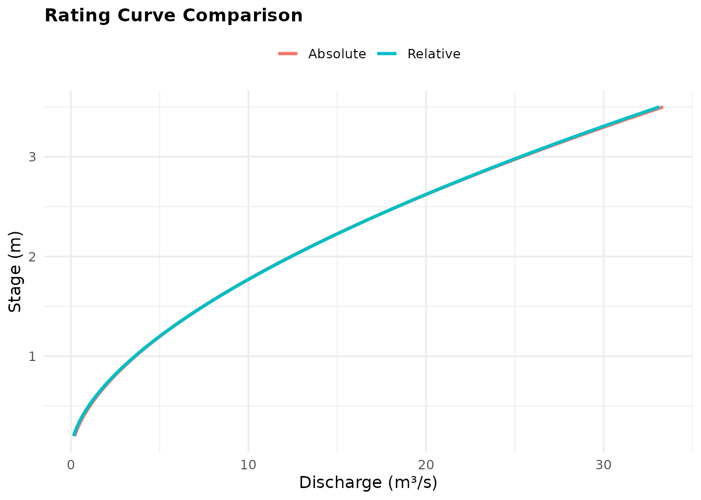

# Non-Standard Rating Optimisation: When and Why

## Why deviate from the default fit

[`rate_optimise()`](https://jonpayneea.github.io/reach.rate/reference/rate_optimise.md)’s
default call – no `objective`, no `n_bounds`, no `gauging_datetime` –
makes three assumptions that are entirely reasonable most of the time:

1.  Every gauging counts equally in *absolute* discharge terms: a 1 m³/s
    miss is a 1 m³/s miss, whether the true flow is 2 m³/s or 2,000
    m³/s.
2.  The exponent `n` in `Q = C(H-a)^n` is estimated purely from whatever
    gaugings you have – no outside knowledge of the channel is brought
    in.
3.  Every gauging counts equally regardless of *when* it was taken.

Each of these can fail to hold. This vignette covers the two situations
where the package already has an answer – proportional gauging error
(`objective = "relative"`) and sparse, physically-constrained extremes
(`n_bounds`) – and one where the groundwork exists but the fix doesn’t
yet (gauging age, `gauging_datetime`). See
[`vignette("rating_curves_guide")`](https://jonpayneea.github.io/reach.rate/articles/rating_curves_guide.md)
for the standard workflow these options extend, and `ROBUST_FITTING.md`
in the package sources for a shorter, code-free version of this same
material.

## When absolute error is the wrong error model

### The problem

Streamflow gauging accuracy is conventionally expressed as a
*percentage* of the reading, not a fixed number of cubic metres per
second (Herschy 2009) – a gauging is typically accurate to within a few
percent whether the flow is a trickle or a torrent. The default fit
doesn’t know this: it minimises absolute squared error, so a limb with
both low and high flows in it will fit the high flows preferentially,
simply because their absolute residuals are numerically larger. The
low-flow shape can suffer as a result.

### Demonstration

``` r

set.seed(11)
stage_m <- seq(0.2, 3.5, by = 0.03)
true_C <- 4; true_a <- 0.05; true_n <- 1.7
discharge_true_cms <- true_C * (stage_m - true_a)^true_n
# Proportional (percentage) noise, not fixed-magnitude noise -- this is
# what "gauging accuracy is a few percent of the reading" looks like.
discharge_cms <- discharge_true_cms * exp(rnorm(length(stage_m), sd = 0.08))
```

``` r

fit_absolute <- rate_optimise(discharge_cms, stage_m)
fit_relative <- rate_optimise(discharge_cms, stage_m, objective = "relative")

rbind(
  data.table(objective = "absolute", fit_absolute@limbs[, .(C, a, n, rmse_cms, r_squared)]),
  data.table(objective = "relative", fit_relative@limbs[, .(C, a, n, rmse_cms, r_squared)])
)
#>    objective        C            a        n rmse_cms r_squared
#>       <char>    <num>        <num>    <num>    <num>     <num>
#> 1:  absolute 3.626593 -0.001674168 1.770528 1.251290 0.9843990
#> 2:  relative 3.915652  0.047154818 1.723349 1.253302 0.9843488
```

Both rows report `rmse_cms`/`r_squared` on the same natural discharge
scale, so they’re directly comparable – `objective` only changes what
the optimiser treats as “best,” not how the result is reported
afterward. With proportional noise like this, `objective = "relative"`‘s
`C`/`a`/`n` sit closer to the true generating values, because the
low-flow gaugings (whose proportional errors are just as informative as
the high-flow ones’ proportional errors) get to pull their proper share
of the fit’s weight.

``` r

plot_rating_curves(Absolute = fit_absolute, Relative = fit_relative)
```



### When to reach for it

If your gaugings span a wide flow range and you know (or suspect)
accuracy is roughly proportional across that range – true of most
current-meter and ADCP gauging – `objective = "relative"` is a
reasonable default choice, not just a fix for a diagnosed problem. It
costs nothing when the two objectives happen to agree.

## When the top of the curve needs a physical anchor

### The problem

The top of a rating – the part covering the biggest floods – is
structurally the least-gauged part of the record, because big floods are
rare and often dangerous or impractical to gauge directly. Left alone,
the fit has to infer the curve’s steepness up there from whatever thin
evidence exists, which can drift to an implausible exponent. But
open-channel hydraulics already tells us roughly what to expect: about
1.5 for a rectangular control, about 2.5 for a triangular/V-notch one,
and Manning’s equation gives roughly 5/3 for a wide channel (Herschy
2009; Rantz et al. 1982) – see
[`vignette("rating_curves_guide")`](https://jonpayneea.github.io/reach.rate/articles/rating_curves_guide.md)’s
“Why a power law” section for the full derivation. `n_bounds` lets that
theory anchor the fit instead of leaving it to guess. For what these
controls actually look like, and how to read a cross-section into a
starting `n_bounds`, see
[`vignette("n_bounds_guide")`](https://jonpayneea.github.io/reach.rate/articles/n_bounds_guide.md).

### Demonstration

``` r

set.seed(23)
# A channel control theory says should be close to rectangular (n ~ 1.5),
# but the fit only has a handful of gaugings above stage 2.5 -- exactly
# the "sparse extremes" situation this section is about.
stage_dense_m <- seq(0.2, 2.5, by = 0.03)
stage_sparse_m <- c(2.7, 2.9, 3.1, 3.3)
stage_m <- c(stage_dense_m, stage_sparse_m)

true_C <- 5; true_a <- 0; true_n <- 1.5
discharge_true_cms <- true_C * (stage_m - true_a)^true_n
discharge_cms <- discharge_true_cms * exp(rnorm(length(stage_m), sd = 0.1))
```

``` r

fit_unconstrained <- rate_optimise(discharge_cms, stage_m)
fit_bounded <- rate_optimise(discharge_cms, stage_m, n_bounds = c(1.4, 1.6))

rbind(
  data.table(fit = "unconstrained", fit_unconstrained@limbs[, .(C, a, n, rmse_cms, r_squared)]),
  data.table(fit = "n_bounds = c(1.4, 1.6)", fit_bounded@limbs[, .(C, a, n, rmse_cms, r_squared)])
)
#>                       fit        C          a        n rmse_cms r_squared
#>                    <char>    <num>      <num>    <num>    <num>     <num>
#> 1:          unconstrained 5.767712 0.08480926 1.374085 1.093207 0.9732990
#> 2: n_bounds = c(1.4, 1.6) 5.558503 0.05907584 1.400000 1.093733 0.9732733
```

With so little data above stage 2.5, the unconstrained exponent can
drift well away from the true, physically-expected value of 1.5 – an
extrapolation risk that matters most exactly where a design flood
assessment would use the curve. `n_bounds = c(1.4, 1.6)` holds the fit
to the range channel-control theory actually supports, at the cost of a
(usually small) increase in fitted error over the *sparse, noisy* region
it constrains.
[`rate_optimise_constrained()`](https://jonpayneea.github.io/reach.rate/reference/rate_optimise_constrained.md)
honours the same bound across every limb it refits, not just the one it
leaves alone, so a multi-limb rating stays consistent with the
constraint throughout.

### What this is not

Le Coz et al. (2014) make the general case for combining hydraulic
knowledge with uncertain gaugings when estimating a rating – `n_bounds`
is this package’s answer to that case, but it is a **hard or soft box
constraint**, not a **prior**. A constraint rules a range of `n` in or
out outright; a true Bayesian prior instead expresses a starting belief
that the data can still overturn, given enough of it. That version –
where channel-control theory would be a prior distribution on `n` rather
than a bound – is a separate, larger, not-yet-started idea tracked as
[issue \#11](https://github.com/JonPayneEA/reach.rate/issues/11). Reach
for `n_bounds` when you’re confident enough in the channel-control type
to rule out other exponents; wait for \#11 – or, today, look at `bdrc`
(Hrafnkelsson et al. 2022), an R package already implementing a true
Bayesian power-law fit – if you’d rather let the data override a merely
plausible assumption.

## When gauging age matters

### The problem

Channels change: the bed shifts, vegetation grows and dies back,
sediment moves, a flood re-cuts the cross-section (Mansanarez et
al. 2019, “Shift happens!”, describe exactly this and how to adjust a
rating when it occurs). A rating fitted from gaugings spanning many
years implicitly treats a measurement from a decade ago as equally
informative about *today’s* channel as one from last month, which won’t
always be true.

### What exists today

[`rate_optimise()`](https://jonpayneea.github.io/reach.rate/reference/rate_optimise.md)
and
[`rate_optimise_segmented()`](https://jonpayneea.github.io/reach.rate/reference/rate_optimise_segmented.md)
accept an optional `gauging_datetime`, and now an opt-in `age_halflife`
that weights each gauging by age – exponential decay down to a floor
(`age_min_weight`) that stops a genuinely large but old flood ever being
discounted to nothing, though it isn’t magnitude-aware (an old extreme
and an old ordinary gauging decay identically).
[`vignette("recency_weighting_guide")`](https://jonpayneea.github.io/reach.rate/articles/recency_weighting_guide.md)
covers the full formula, a worked example, and what the floor does and
doesn’t protect against; the fuller, magnitude-aware version remains
open in [issue \#9](https://github.com/JonPayneEA/reach.rate/issues/9).

``` r

gauging_datetime <- as.Date("2015-01-01") + round(seq_along(stage_dense_m) * 20)
fit_dated <- rate_optimise(
  discharge_cms[seq_along(stage_dense_m)], stage_dense_m,
  gauging_datetime = gauging_datetime
)
head(fit_dated@gaugings)
#>    discharge_cms stage_m gauging_datetime  limb
#>            <num>   <num>           <Date> <int>
#> 1:     0.4559383    0.20       2015-01-21     1
#> 2:     0.5280606    0.23       2015-02-10     1
#> 3:     0.7262610    0.26       2015-03-02     1
#> 4:     0.9342280    0.29       2015-03-22     1
#> 5:     0.9999470    0.32       2015-04-11     1
#> 6:     1.1565643    0.35       2015-05-01     1
```

`age_halflife` is left `NULL` by default, so supplying
`gauging_datetime` alone – as above – still changes nothing about the
fit; `fit_dated`’s coefficients are identical to what an undated call
would produce. Recency weighting only switches on once `age_halflife` is
set too.

## Where to go next

[`vignette("rating_curves_guide")`](https://jonpayneea.github.io/reach.rate/articles/rating_curves_guide.md)
covers the standard fitting workflow these options extend.
`ROBUST_FITTING.md` in the package sources gives a shorter, code-free
version of this same material, written for anyone who wants the
reasoning without the R. The GitHub issues linked throughout (#9, \#11)
carry the open technical and design questions for what isn’t built yet.

## References

Herschy, R. W. (2009). *Streamflow Measurement* (3rd ed.). Routledge.

Hrafnkelsson, B., Sigurdarson, H., Rögnvaldsson, S., Jansson, A. Ö.,
Vias, R. D., & Gardarsson, S. M. (2022). Generalization of the power-law
rating curve using hydrodynamic theory and Bayesian hierarchical
modeling. *Environmetrics*, 33(2), e2711.

Le Coz, J., Renard, B., Bonnifait, L., Branger, F., & Le Boursicaud, R.
(2014). Combining hydraulic knowledge and uncertain gaugings in the
estimation of hydrometric rating curves: a Bayesian approach. *Journal
of Hydrology*, 509, 573-587.

Mansanarez, V., Westerberg, I. K., Lam, N., & Lyon, S. W. (2019). Shift
happens! Adjusting stage-discharge rating curves to morphological
changes at known times. *Water Resources Research*, 55(8), 6642-6661.

Rantz, S. E., et al. (1982). *Measurement and Computation of Streamflow*
(Water Supply Paper 2175). U.S. Geological Survey.
