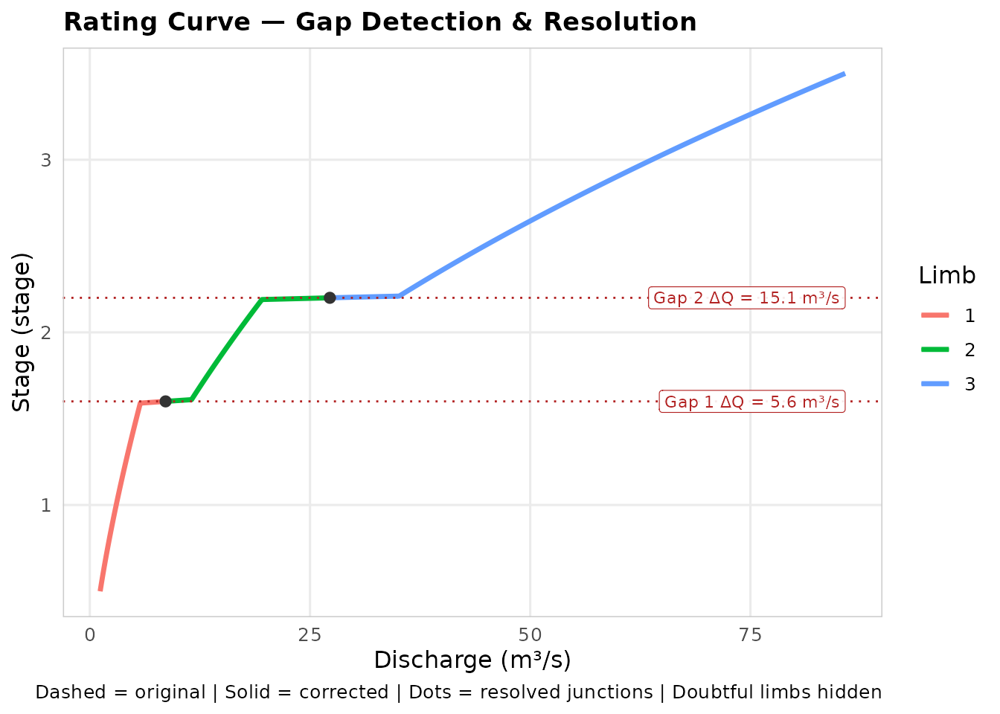
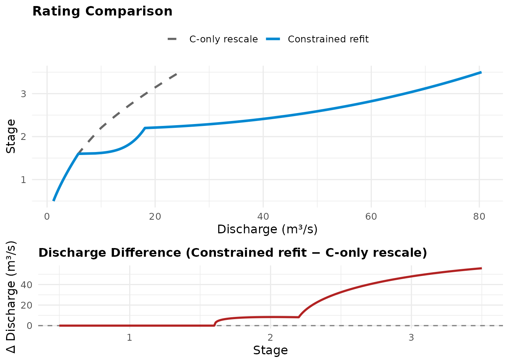
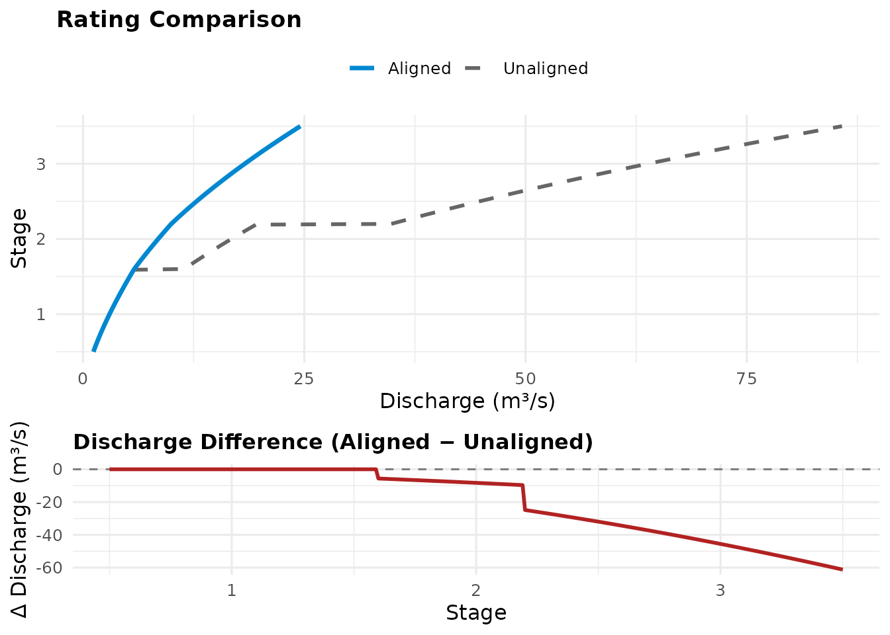

# Rating Curves: Theory, Functions, and Guidance

## What a rating curve is

A river gauging station measures water level continuously. It does not
measure flow. Level (stage) is cheap: a pressure transducer or a float
in a stilling well, logging every fifteen minutes for decades. Flow
(discharge) is expensive: someone has to stand in or above the river
with a current meter or an ADCP and measure it directly. A single
discharge measurement is called a gauging, and a typical station
accumulates a few dozen to a few hundred of them over its life.

The rating curve is the bridge between the two. It is a fitted
relationship that converts the continuous stage record into a continuous
discharge record, calibrated against the occasional gaugings. Every flow
statistic you have ever used from a gauging station, every QMED, every
flood peak in HiFlows, passed through a rating curve on its way to you.
The quality of the rating bounds the quality of everything downstream of
it.

### The equation

This toolkit fits the standard hydrometric form:

``` math
Q = C\,(H - a)^{n}
```

where $`Q`$ is discharge (m³/s), $`H`$ is stage (m), and $`C`$, $`a`$,
$`n`$ are fitted coefficients. The offset $`a`$ deserves a moment. Stage
is measured against an arbitrary local datum, not against the point
where flow actually ceases. The quantity $`H - a`$ converts stage to
effective head above the level of zero flow, and it is head, not raw
stage, that drives flow through a control. When $`H - a \le 0`$ the
river is below its zero-flow level and $`Q = 0`$ by definition.

### Why a power law

The power law is not a curve-fitting convenience. It is what
open-channel hydraulics predicts. Flow over a rectangular weir goes as
head to the power 1.5; over a V-notch, head to the power 2.5; Manning’s
equation for a wide channel gives discharge roughly as depth to the
power 5/3. Every common control produces discharge as head raised to
some exponent between about 1.3 and 2.5, with $`C`$ absorbing the
geometry and roughness (Herschy 2009; Rantz et al. 1982). Fitting
$`Q = C(H-a)^n`$ is fitting the family of curves the physics says to
expect.

A useful property follows: on log axes the power law is a straight line,

``` math
\log Q = \log C + n \log(H - a)
```

with slope $`n`$. This is why hydrometrists have plotted ratings on
log-log paper for a century, and why a change of slope on that plot
signals a change of physical control.

### A convention

Throughout this toolkit, plots put discharge on the x axis and stage on
the y axis. This is the hydrometric convention: the rating is read the
way the station uses it, from a measured stage across to a discharge.
Every plotting function here follows it, including the cross-section
demonstration, so the curves are directly comparable.

## Why ratings have limbs

A single power law describes a single control. Real channels change
control as they fill. At low flow the station may be controlled by a
gravel riffle or a weir crest immediately downstream (a section
control). As stage rises the riffle drowns out and the friction of the
channel itself takes over (channel control). Higher still, the river
tops its banks and the floodplain begins to convey flow, changing the
effective geometry entirely.

Each regime approximates a different power law. The standard response is
a multi-limb rating: the stage range is split at breakpoints, and each
limb gets its own $`C`$, $`a`$, $`n`$. The breakpoints should correspond
to real physical transitions, a berm, a bank top, a bypass channel
activating, and choosing them is a hydrological judgement, not a
statistical one. Section 5 returns to this.

## The objects

The toolkit represents its results as three S7 classes rather than bare
tables. The practical consequence for you as a user is small: you access
contents with `@` rather than `$`, and the objects carry more than
numbers.

`FlodeRating` is the result of
[`rate_optimise()`](https://jonpayneea.github.io/reach.rate/reference/rate_optimise.md).
`@limbs` holds one row per limb (bounds, coefficients, diagnostics),
`@gaugings` holds the data it was fitted to, `@bootstrap` and
`@fit_starts` hold uncertainty and fitting bookkeeping when produced,
`@status` records whether the fit is as fitted or has been amended, and
`@provenance` records how it was made.

`FlodeSegmentedRating` is the result of
[`rate_optimise_segmented()`](https://jonpayneea.github.io/reach.rate/reference/rate_optimise_segmented.md),
a structurally different model covered in section 9.

`FlodeRatingTable` is the equation-table representation used for gap
checking and application: `lower_level`, `upper_level`, `C`, `a`, `n`
per limb, same names and sign convention as `FlodeRating`’s `@limbs`. It
carries `@status` and `@previous`, so an amended table references the
exact object it was amended from. This is an audit trail by construction
rather than by discipline: you cannot end up holding an aligned table
with no record of what it was aligned from.

Three shared generics work across the classes:
[`rating_plot()`](https://jonpayneea.github.io/reach.rate/reference/rating_plot.md)
draws whichever fit you hand it,
[`apply_rating()`](https://jonpayneea.github.io/reach.rate/reference/apply_rating.md)
converts stage to discharge with whichever representation you hold, and
[`as_rating_table()`](https://jonpayneea.github.io/reach.rate/reference/as_rating_table.md)
converts a fit to the table form. The class system chooses the right
implementation; you use one name.

A note on why the fit remembers its own gaugings. Every diagnostic,
residual plot, and bootstrap in this toolkit needs the original data,
and a rating separated from its gaugings is a rating you can no longer
question. Keeping them together is deliberate.

This section is deliberately brief –
[`vignette("s7_objects_guide")`](https://jonpayneea.github.io/reach.rate/articles/s7_objects_guide.md)
covers `@`-access, [`print()`](https://rdrr.io/r/base/print.html),
`S7_inherits()`, and the `@status`/`@previous` audit chain in full,
including a validator actually catching a malformed construction.

### A running example

Every chunk from here on operates on one running example: a three-limb
rating station, gauged independently limb by limb (as real stations
usually are – you don’t gauge the whole range in one session), which is
exactly the situation that produces junction gaps. The story continues
chunk by chunk down to section 8; sections 9 and 10 introduce their own,
separate synthetic data since they use a structurally different model.
Every number below is synthetic – the point is the shape of the
workflow, not these particular coefficients.

``` r

set.seed(42)
stage_m <- seq(0.5, 3.5, by = 0.03)
true_limb <- cut(
  stage_m,
  breaks = c(0.5, 1.6, 2.2, 3.5),
  labels = FALSE, include.lowest = TRUE
)
true_coefs_dt <- data.table(C = c(3, 6, 10), a = c(0, 0.1, 0.2), n = c(1.4, 1.6, 1.8))
discharge_cms <- true_coefs_dt$C[true_limb] *
  (stage_m - true_coefs_dt$a[true_limb])^true_coefs_dt$n[true_limb] +
  rnorm(length(stage_m), sd = 0.05)

length(stage_m)
#> [1] 101
range(stage_m)
#> [1] 0.5 3.5
```

## Fitting: `rate_optimise()`

``` r

fit <- rate_optimise(discharge_cms, stage_m, control = c(1.6, 2.2))
fit@limbs[, .(limb, C, a, n, rmse_cms, r_squared, n_obs)]
#>     limb         C           a        n   rmse_cms r_squared n_obs
#>    <int>     <num>       <num>    <num>      <num>     <num> <int>
#> 1:     1  2.772226 -0.05503033 1.459775 0.05707128 0.9982030    37
#> 2:     2  7.249417  0.24224858 1.487198 0.04004832 0.9997172    20
#> 3:     3 10.188269  0.21374013 1.790580 0.04707026 0.9999901    44
```

### The method

[`rate_optimise()`](https://jonpayneea.github.io/reach.rate/reference/rate_optimise.md)
fits each limb by nonlinear least squares: it finds the $`C`$, $`a`$,
$`n`$ minimising the residual sum of squares

``` math
\mathrm{RSS} = \sum_{i}\left(Q_i - C\,(H_i - a)^n\right)^2
```

over that limb’s gaugings, using the Levenberg-Marquardt algorithm
(Levenberg 1944; Marquardt 1963) as implemented in
[`minpack.lm::nlsLM`](https://rdrr.io/pkg/minpack.lm/man/nlsLM.html).

Why not just take logs and fit a straight line by ordinary regression?
Because the two minimise different things. Log-space regression
minimises relative error, which treats a 10% miss at 2 m³/s and a 10%
miss at 200 m³/s as equally bad. Least squares in real space minimises
absolute error, so the high-flow gaugings dominate the fit. For flood
forecasting, where the cost of error is concentrated at high flows,
real-space fitting is usually the right default, but be aware of the
choice you are inheriting: your low-flow fit is being traded for your
high-flow fit. Neither convention is wrong; they answer different
questions.

Note also that $`a`$ is a fitted parameter, not just log-space
regression’s problem to avoid: the classical log-log method requires
knowing $`a`$ before you can take the logarithm, which is exactly why it
was historically estimated by trial and error. Nonlinear fitting
estimates all three together.

### Bounds

The fit is constrained so that $`C > 0`$, $`n > 0`$, and $`H - a > 0`$
for every gauging in the limb. Without these, the optimiser is free to
wander into regions where the equation is negative, complex, or
undefined, and will occasionally converge there on awkward data. The
bounds do not push the fit anywhere; they only fence off territory where
no valid rating exists.

### Multiple starting points

Nonlinear least squares is iterative: it starts from a guess and
improves it. A poor guess can strand the optimiser in a local minimum, a
fit that no small adjustment improves but that a very different set of
coefficients would beat. By default (`multi_start = TRUE`), each limb is
fitted from several starting combinations: a few plausible exponents, a
data-driven estimate from a quick log-log regression, a data-scaled
$`C`$. Each converged result is checked for validity (finite,
non-decreasing discharge across the limb) and the best valid result
wins. Every attempt is recorded in `@fit_starts`, so you can see whether
the starts agreed (reassuring) or scattered (a sign the data constrain
the fit weakly).

The `near_bound` column flags a fit whose $`n`$ or $`a`$ finished
pressed against its lower bound. That is worth a second look: it can
mean a degenerate, nearly-flat fit, or an offset being forced against
the lowest gauging, either of which suggests the limb or its data need
attention.

### Reading the diagnostics

`@limbs` reports, per limb: `rmse_cms`, `r_squared`, `n_obs`,
`n_unique_stage`, `mean_error_cms`, `median_abs_error_cms`,
`max_abs_error_cms`, and `residual_df`.

Three points of guidance. First, `r_squared` close to 1 is necessary but
weak: a limb spanning a large discharge range can post an excellent
$`R^2`$ over a mediocre fit, because the variance being explained is
mostly the range itself. Compare limbs against each other; the one
sitting noticeably below its neighbours is the signal, not any fixed
threshold. Second, `rmse_cms` is in the units of your gaugings, so
compare it to the gauging uncertainty you would expect at that site,
typically 5 to 10% of flow for a good current-meter gauging (WMO 2010).
An RMSE well inside gauging uncertainty is as good as the data can
support. Third, `n_obs` of three fits three parameters exactly, with no
residual degrees of freedom (`residual_df = 0`) and therefore no ability
to say whether the equation form suits the data at all. Treat
single-figure `n_obs` as provisional.

## Choosing breakpoints: `suggest_breakpoints()`

``` r

candidates_dt <- suggest_breakpoints(discharge_cms, stage_m, max_breaks = 2L)
suggested_breakpoints_vector(candidates_dt)
#> [1] 1.58 2.18
```

### The trap this function avoids

Adding a limb always improves the fit. Three extra parameters will
always reduce RSS, whether or not a real change of control exists, in
the same way a higher-order polynomial always tracks data more closely.
Raw fit improvement therefore cannot tell you whether a breakpoint is
justified. Some penalty for complexity is required.

### The method

[`suggest_breakpoints()`](https://jonpayneea.github.io/reach.rate/reference/suggest_breakpoints.md)
scores each candidate stage by actually fitting a two-limb rating there
with
[`rate_optimise()`](https://jonpayneea.github.io/reach.rate/reference/rate_optimise.md)
and comparing it against the current best model using the Akaike
Information Criterion (Akaike 1974):

``` math
\mathrm{AIC} = n \ln\!\left(\frac{\mathrm{RSS}}{n}\right) + 2k
```

where $`n`$ is the number of gaugings and $`k`$ the number of fitted
parameters (three per limb). The first term rewards fit; the second
charges for it. A candidate breakpoint is only eligible if the two-limb
model’s AIC beats the one-limb model’s and the relative RSS reduction
clears `min_improvement` (default 2%), which screens out breakpoints
that are statistically cheap but practically negligible.

Multiple breakpoints are found greedily: the best candidate from round
one is fixed, and round two searches for a further breakpoint against
that improved baseline, at least `min_gap` away from any breakpoint
already chosen. The search stops as soon as a round finds nothing that
clears the bar, so asking for `max_breaks = 3` will not manufacture a
third breakpoint. The full candidate table is returned, one row per
candidate per round, with scores, RSS improvements, observation counts
each side, and a status;
[`suggested_breakpoints_vector()`](https://jonpayneea.github.io/reach.rate/reference/suggested_breakpoints_vector.md)
extracts just the selected stages. One caution when reading the table:
scores are only comparable within a round, since each round is scored
against a different baseline.

### The judgement that remains yours

A statistically supported breakpoint is evidence that the data bend
there. It is not evidence that a berm, a bank top, or a drowning weir
exists there. Walk the reach, look at the cross-section, check the
breakpoint against surveyed features. The function narrows the search;
it does not close it. The reverse also holds: a real control change can
hide below the statistical threshold if the exponents either side happen
to be similar.

## Diagnosing a fit

Residuals, extrapolation, and channel shape below aren’t the whole
diagnostic picture:
[`vignette("leverage_influence_guide")`](https://jonpayneea.github.io/reach.rate/articles/leverage_influence_guide.md)
covers a different question none of these three answer – not how far off
a gauging ends up after fitting, but how much it shaped the fit to begin
with.

### `plot_rating_residuals()`

$`R^2`$ and RMSE say how good a fit is; residuals say where it is weak.
This plot shows observed minus fitted discharge against stage, one panel
per limb.

``` r

plot_rating_residuals(fit)
```


What you are looking for: a curved trend within a panel means the power
law is the wrong shape for that limb, often a sign of a missed
breakpoint; a widening fan means the fit degrades toward one end of the
limb, commonly the low end near the zero-flow datum; a cluster of
same-signed residuals suggests something systematic, such as a batch of
gaugings taken during a period when the control had shifted. Scattered,
zero-centred residuals across the whole panel are what a sound fit looks
like.

### `flag_extrapolated_limbs()`

``` r

fit <- flag_extrapolated_limbs(fit)
fit@limbs[, .(limb, doubtful)]
#>     limb doubtful
#>    <int>   <lgcl>
#> 1:     1    FALSE
#> 2:     2    FALSE
#> 3:     3    FALSE
```

A limb’s declared range comes from the breakpoints you chose, not from
where the gaugings reached. The top limb of most stations is declared up
to some design level while its highest actual gauging sits well below:
everything between is extrapolation, however good the fit statistics
look. Extrapolating a rating is sometimes unavoidable, particularly for
flood forecasting, but it should never be invisible.

This function compares each limb’s declared bounds against its gauged
support and flags a limb `doubtful` where the unsupported distance
exceeds `tol_frac` of the limb’s width (default 5%). Separately, if you
supply an operational range (the stages your forecasting or reporting
actually requires), it flags whether the whole rating fails to reach it.
The `doubtful` flag is carried through
[`as_rating_table()`](https://jonpayneea.github.io/reach.rate/reference/as_rating_table.md)
into the expanded table and the plots, so a weakly supported limb stays
visibly weakly supported all the way downstream.

### `plot_rating_cross_section()`: check the fit against the channel itself

Every diagnostic so far reads the fit against its own gaugings. If you
also have a surveyed cross-section,
[`plot_rating_cross_section()`](https://jonpayneea.github.io/reach.rate/reference/plot_rating_cross_section.md)
puts the channel’s actual shape on the same figure as the curve it
produced, by rescaling the survey’s distance onto the discharge axis:

``` r

xs <- data.table(
  distance_m = c(-6, -3, -1, 1, 3, 6),
  elevation_m = c(3.6, 0.2, 0, 0, 0.2, 3.6)
)
plot_rating_cross_section(fit, xs)
```


`elevation_m` must already sit on the same vertical datum as `stage_m` –
this is not a survey-to-gauge-datum converter, only an overlay. The
secondary axis on top reads off the true distance scale; the rescale
itself carries no hydraulic meaning; it only lets two curves that live
on genuinely different axes (distance and discharge) share one plot.
Read the shape the same way
[`vignette("n_bounds_guide")`](https://jonpayneea.github.io/reach.rate/articles/n_bounds_guide.md)
reads its idealised ones: a channel that widens sharply above some stage
is a compound-channel signal worth a fresh look at whether one set of
limbs still describes it, independent of anything `rmse_cms` or
`r_squared` says.

### `rate_from_cross_section()`: a rating with no gaugings at all

Everything up to here starts from gaugings.
[`rate_from_cross_section()`](https://jonpayneea.github.io/reach.rate/reference/rate_from_cross_section.md)
doesn’t: given the same kind of surveyed section as the overlay above,
plus a bed slope and a Manning’s roughness, it computes wetted area and
perimeter at a dense sequence of stages, converts each to a discharge by
Manning’s equation, and fits that synthetic series through
[`rate_optimise()`](https://jonpayneea.github.io/reach.rate/reference/rate_optimise.md)’s
own pipeline:

``` r

xs_theoretical <- data.table(
  distance_m = c(-6, -3, 3, 6),
  elevation_m = c(2.4, 0, 0, 2.4)
)
theoretical_fit <- rate_from_cross_section(
  xs_theoretical, slope = 0.001, roughness = 0.035, n_points = 60
)
theoretical_fit@provenance$source
#> [1] "cross_section_theoretical"

plot_rating_cross_section(theoretical_fit, xs_theoretical)
```


The result is an ordinary `FlodeRating` – same `C`/`a`/`n` limbs, same
diagnostics – distinguished from a gauged fit only by
`provenance$source`, which reads `"cross_section_theoretical"` rather
than `"gauged"`. Because `cross_section` is exactly the object
[`plot_rating_cross_section()`](https://jonpayneea.github.io/reach.rate/reference/plot_rating_cross_section.md)
also takes, overlaying the fit on the very geometry that produced it is
a built-in sanity check: if the curve doesn’t visually track the channel
shape, something is off in the slope, roughness, or survey before this
ever meets a real gauging.

Treat this as a standalone diagnostic for now, not a way to extend an
existing gauged rating past its top gauging – that composition (grafting
a cross-section-derived high limb onto a gauged one via
[`graft_rating()`](https://jonpayneea.github.io/reach.rate/reference/graft_rating.md))
isn’t wired up yet. A single Manning’s `n` is applied across the whole
wetted section; a genuine compound channel, with a distinct low-flow
channel and overbank berms, is only approximated by that, not modelled
with the divided-channel method’s separate per-subsection roughness. And
the survey must reach at least as high as the highest stage you rate –
[`rate_from_cross_section()`](https://jonpayneea.github.io/reach.rate/reference/rate_from_cross_section.md)
does not assume the end points continue as vertical banks above the
survey’s own top.

A cross-section fit is the general-purpose, no-gaugings-required option.
At a weir- or flume-controlled station specifically,
[`vignette("weir_flume_guide")`](https://jonpayneea.github.io/reach.rate/articles/weir_flume_guide.md)
covers a more precise alternative:
[`weir_discharge_rectangular()`](https://jonpayneea.github.io/reach.rate/reference/weir_discharge_rectangular.md),
[`weir_discharge_vnotch()`](https://jonpayneea.github.io/reach.rate/reference/weir_discharge_vnotch.md),
[`weir_discharge_cipoletti()`](https://jonpayneea.github.io/reach.rate/reference/weir_discharge_cipoletti.md),
and
[`flume_discharge_parshall()`](https://jonpayneea.github.io/reach.rate/reference/flume_discharge_parshall.md)
compute discharge from the structure’s own published equation and
geometry, with GUM-style propagated uncertainty, rather than an
approximate Manning calculation.

## The junction gap problem

Fit each limb independently and their curves will not meet. Limb 1’s
equation, evaluated at the shared boundary stage, gives one discharge;
limb 2’s gives another. The mismatch

``` math
\Delta Q = C_2(H_b + a_2)^{n_2} - C_1(H_b + a_1)^{n_1}
```

at boundary stage $`H_b`$ is generally non-zero because nothing in
either fit knew the other existed. The result is a rating that jumps: a
river rising smoothly through the boundary appears to change flow
discontinuously, which is hydraulic nonsense and can inject spurious
steps into flow records and forecast inputs.

### Detecting it

``` r

rating_table <- as_rating_table(fit)
rc_raw_dt <- expand_rating_table(rating_table, step = 0.01)
gaps_dt <- detect_rc_gaps(rc_raw_dt)
#> INFO [2026-09-02 08:18:51] Checked 2 junction(s): 2 gap(s) flagged.
gaps_dt
#>    junction limb_lower limb_upper stage_break stage_lower_end stage_upper_start
#>       <int>     <char>     <char>       <num>           <num>             <num>
#> 1:        1          1          2         1.6             1.6               1.6
#> 2:        2          2          3         2.2             2.2               2.2
#>    junction_type q_lower_end q_upper_start   gap_abs   gap_rel gap_flagged
#>           <char>       <num>         <num>     <num>     <num>      <lgcl>
#> 1:  shared_stage    5.784104      11.42439  5.640288 0.9751359        TRUE
#> 2:  shared_stage   19.688121      34.81432 15.126203 0.7682909        TRUE
```

[`expand_rating_table()`](https://jonpayneea.github.io/reach.rate/reference/expand_rating_table.md)
evaluates each limb’s equation across its range at a fixed stage step,
producing the discretised stage-discharge table many EA ratings are
maintained in day to day.
[`detect_rc_gaps()`](https://jonpayneea.github.io/reach.rate/reference/detect_rc_gaps.md)
then reports one row per junction: the discharge each side, the absolute
and relative mismatch, and a flag where the mismatch exceeds `tol_abs`
(default 0.5 m³/s) or `tol_rel` (default 2%). It also classifies the
junction type, since two limbs can also meet with a stage gap or overlap
rather than a shared boundary stage, and a discharge comparison only
makes sense at a genuinely shared stage.
[`plot_rc_gaps()`](https://jonpayneea.github.io/reach.rate/reference/plot_rc_gaps.md)
draws the before and after curves with the flagged junctions labelled.

Set the tolerances against what matters at the site. A 0.5 m³/s step is
invisible on a large river and material on a small one; the relative
tolerance exists for exactly that reason.

## Ways to close a gap

The toolkit offers several closure strategies because they make
different trade-offs, and the right one depends on what you hold and
what you need.

### `resolve_rc_gaps()`: patch the table

Adjusts the discretised table rows either side of each flagged junction.
`method = "midpoint"` moves both sides to the midpoint of their
estimates; `"match_lower_to_upper"`/`"match_upper_to_lower"` move only
the single junction row to defer entirely to one limb, for when one side
is clearly better gauged than the other;
`"extend_lower_to_upper"`/`"extend_upper_to_lower"` go further and
rescale the *whole* deferring limb’s curve, not just its junction row,
so the reshaping is visible across the limb rather than only at its
boundary.

``` r

rc_fixed_dt <- resolve_rc_gaps(rc_raw_dt, method = "midpoint")
#> INFO [2026-09-02 08:18:51] Checked 2 junction(s): 2 gap(s) flagged.
#> INFO [2026-09-02 08:18:51] Junction 1 (limbs 1/2, stage 1.6): gap 5.78 -> 11.42 | agreed Q = 8.6042
#> INFO [2026-09-02 08:18:51] Junction 2 (limbs 2/3, stage 2.2): gap 19.69 -> 34.81 | agreed Q = 27.2512
plot_rc_gaps(rc_raw_dt, rc_fixed_dt)
#> INFO [2026-09-02 08:18:51] Checked 2 junction(s): 2 gap(s) flagged.
```



This is fast and needs nothing but the table. Its limitation is
fundamental: the equations that produced the table are untouched, so
anyone re-expanding the rating, or evaluating the equations directly,
sees the gap again. Use it when the table is the product and the
equations are not going anywhere.

### `align_limb_equations()`: rescale C

``` r

aligned_result <- align_limb_equations(rating_table, anchor_limb = 1L)
aligned_result@status
#> [1] "post_fit_aligned"
identical(aligned_result@previous, rating_table)
#> [1] TRUE
```

Fixes the equations themselves, using only the equations. Hold one limb
fixed (the anchor, by default the lowest, usually the best gauged), then
for each neighbouring limb solve for the $`C`$ that forces an exact
match at the junction:

``` math
C_{\text{new}} = \frac{Q_{\text{target}}}{(H_b - a)^{n}}
```

where $`Q_{\text{target}}`$ is the already-corrected neighbour’s
discharge at the junction stage $`H_b`$. The correction propagates
outward from the anchor, so every junction along the chain closes
exactly, and $`a`$ and $`n`$ (the curve’s datum and shape) are
untouched. The original $`C`$ is kept alongside the scale factor and
percentage change, and the result is a new `FlodeRatingTable` whose
`@previous` references the exact pre-alignment object: an auditable
amendment, not a silent overwrite.

The cost is honest: the rescaled $`C`$ is no longer the least-squares
optimum for that limb’s own gaugings. You have traded a small amount of
within-limb fit for continuity, holding shape fixed. When only the
equations survive (a legacy rating, an imported table), this is the best
available move.

Call it on a `FlodeRating` directly
(`align_limb_equations(fit, anchor_limb = 1L)`) instead of on a table,
and the result stays a `FlodeRating` rather than downgrading to a
`FlodeRatingTable`: gaugings carry through unchanged (equations are
rescaled, not boundaries, so which limb a gauging belongs to never
changes here), `@limbs` diagnostics are recomputed against the rescaled
$`C`$ rather than left describing the pre-alignment fit, and
[`rating_plot()`](https://jonpayneea.github.io/reach.rate/reference/rating_plot.md)/[`plot_rating_residuals()`](https://jonpayneea.github.io/reach.rate/reference/plot_rating_residuals.md)
work on the result immediately, since it is the same class they were
always written for.

### `align_limb_boundaries()`: relocate the junction

Rather than change $`C`$ at a fixed junction stage,
[`align_limb_boundaries()`](https://jonpayneea.github.io/reach.rate/reference/align_limb_boundaries.md)
leaves every limb’s equation completely untouched and instead moves the
junction itself to wherever the two limbs’ curves actually cross – the
stage $`H`$ solving
$`C_{\text{lower}}(H-a_{\text{lower}})^{n_{\text{lower}}} = C_{\text{upper}}(H-a_{\text{upper}})^{n_{\text{upper}}}`$.
Where that root exists, both curves already agree there, so nothing
about either equation needs to change.

``` r

aligned_boundaries <- align_limb_boundaries(fit)
#> Warning: align_limb_boundaries(): limb 2 and 3's curves do not cross within
#> [0.5754, 3.5]; leaving this junction's boundary unchanged.
#> Warning: align_limb_boundaries(): bootstrap uncertainty (n_boot) and
#> multi-start bookkeeping describe the pre-amendment fit and are not recomputed
#> for this amendment; dropped rather than presented alongside updated point
#> estimates.
aligned_boundaries@limbs[, .(limb, lower_stage_m, upper_stage_m, C, a, n, rmse_cms, r_squared, n_obs, boundary_adjusted)]
#>     limb lower_stage_m upper_stage_m         C           a        n   rmse_cms
#>    <int>         <num>         <num>     <num>       <num>    <num>      <num>
#> 1:     1     0.5000000     0.5753647  2.772226 -0.05503033 1.459775 0.04105721
#> 2:     2     0.5753647     2.2000000  7.249417  0.24224858 1.487198 2.33401589
#> 3:     3     2.2000000     3.5000000 10.188269  0.21374013 1.790580 0.04707026
#>    r_squared n_obs boundary_adjusted
#>        <num> <int>            <lgcl>
#> 1: 0.6399419     3              TRUE
#> 2: 0.8499195    54              TRUE
#> 3: 0.9999901    44             FALSE
```

Called on a `FlodeRating`, as here, the result stays a `FlodeRating`:
gaugings are reassigned to whichever limb the new boundary puts them in
(a relocation can shift gaugings across the junction, in either
direction), and every limb’s diagnostics are recomputed from that
reassignment – never left describing the pre-alignment gauging split.

Junction 1 relocated from 1.6 m down to about 0.58 m – a genuine
crossing, but a large one: limb 1 is left with only 3 gaugings and an
$`R^2`$ of 0.64, a much weaker within-limb fit than the original 1.6 m
breakpoint gave it. A relocation this size is not a bug – the curves
really do cross there – but it is exactly the kind of result to check
against `lower_stage_m_original`/`upper_stage_m_original` before
trusting it operationally, rather than accepting any relocation
uncritically. Junction 2 raised a warning instead: limb 2 and limb 3’s
curves do not cross anywhere within either limb’s own fitted range, so
the function leaves that boundary unchanged rather than inventing a join
where none exists.
[`align_limb_equations()`](https://jonpayneea.github.io/reach.rate/reference/align_limb_equations.md)’s
`C`-only rescale is the safer tool for a junction like that one.

[`align_limb_boundaries()`](https://jonpayneea.github.io/reach.rate/reference/align_limb_boundaries.md)
also accepts a `junctions` argument to restrict which junction is
attempted, useful for deliberately leaving a junction alone – a
known-good join, or one better handled by
[`align_limb_equations()`](https://jonpayneea.github.io/reach.rate/reference/align_limb_equations.md)
– even where a crossing does exist.

### `rate_optimise_constrained()`: refit under the constraint

``` r

fit_constrained <- rate_optimise_constrained(discharge_cms, stage_m, control = c(1.6, 2.2))
fit_constrained@limbs[, .(limb, C, a, n, rmse_cms, r_squared, aligned)]
#>     limb         C           a         n   rmse_cms r_squared aligned
#>    <int>     <num>       <num>     <num>      <num>     <num>  <lgcl>
#> 1:     1  2.772226 -0.05503033 1.4597750 0.05707128 0.9982030   FALSE
#> 2:     2 19.815348  1.59906869 0.1764376 0.91568577 0.8521371    TRUE
#> 3:     3 71.280869  2.16313908 0.4150836 4.18657137 0.9219092    TRUE
```

When the raw gaugings are available, the job can be done properly.
Rather than adjusting an already-fitted equation, each non-anchor limb
is refitted against its own gaugings subject to matching its neighbour
exactly at the junction. The constraint is built into the model by
reparameterisation:

``` math
Q = Q_{\text{target}}\left(\frac{H - a}{H_b - a}\right)^{n}
```

At $`H = H_b`$ the bracket equals 1 and $`Q = Q_{\text{target}}`$
identically, for any $`a`$ and $`n`$. Continuity is therefore guaranteed
by construction, and the optimiser is free to choose the $`a`$ and $`n`$
that best fit the limb’s gaugings within that guarantee; $`C`$ is
recovered afterwards as $`Q_{\text{target}} / (H_b - a)^n`$. Two
parameters compensate instead of one, so this generally fits each limb’s
data better than the C-only rescale. The propagation logic is the same
anchor-outward chain.

One honest caveat, reported rather than hidden: any bootstrap
uncertainty computed during the initial unconstrained fit describes that
fit, not the constrained one, so it is dropped with a warning rather
than carried through as if it still applied. The same discipline applies
to the multi-start bookkeeping.

### Choosing between them

Equations only, table is the product:
[`resolve_rc_gaps()`](https://jonpayneea.github.io/reach.rate/reference/resolve_rc_gaps.md).
Equations only, equations are the product, and a boundary relocation is
acceptable:
[`align_limb_boundaries()`](https://jonpayneea.github.io/reach.rate/reference/align_limb_boundaries.md).
Equations only, the boundary must stay fixed (or the curves don’t
actually cross):
[`align_limb_equations()`](https://jonpayneea.github.io/reach.rate/reference/align_limb_equations.md).
Raw gaugings available:
[`rate_optimise_constrained()`](https://jonpayneea.github.io/reach.rate/reference/rate_optimise_constrained.md).
The comparison below is worth running once to calibrate your intuition
for how much the last two actually differ in practice.

``` r

rating_constrained_table <- as_rating_table(fit_constrained)
method_comparison <- compare_ratings(aligned_result, rating_constrained_table)
method_comparison$discharge[, .(
  max_abs_diff_cms = max(abs(discharge_diff)),
  max_abs_pct_diff = max(abs(discharge_pct_diff), na.rm = TRUE)
)]
#>    max_abs_diff_cms max_abs_pct_diff
#>               <num>            <num>
#> 1:         55.85452         270.0024
plot_rating_comparison(method_comparison, old_label = "C-only rescale", new_label = "Constrained refit")
```



## A different architecture: `rate_optimise_segmented()`

Everything so far reconciles independent limbs after the fact. Hodson et
al. (2024), in the USGS `ratingcurve` package, parameterise the problem
so there is nothing to reconcile:

``` math
Q = C \cdot \max(H - b_1,\, 0)^{n_1} \cdot \prod_{j \ge 2} \bigl(\max(H - b_j,\, 0) + 1\bigr)^{n_j}
```

Here $`b_1`$ is the stage of zero flow and $`b_2, \dots, b_k`$ are the
interior breakpoints. Read the product term carefully: at and below its
own breakpoint, each later factor is $`(0 + 1)^{n_j} = 1`$, exactly
inert. Above its breakpoint it begins multiplying flow up (or down, for
$`n_j < 0`$ behaviour in their general form; here exponents are fitted
freely). Every segment therefore contributes across the whole range
above its threshold rather than owning a disjoint band, transitions are
smooth, and continuity is automatic by construction. There is no
junction gap to detect, resolve, or align in this model, because the
model cannot produce one.

This section uses its own synthetic gaugings – three multiplicative
segments rather than three independent limbs – since that is what this
model structurally fits:

``` r

set.seed(7)
stage_seg_m <- seq(0.3, 3.5, by = 0.03)
q1 <- 4 * pmax(stage_seg_m - 0.1, 0)^1.55
q2 <- (pmax(stage_seg_m - 1.6, 0) + 1)^0.9
q3 <- (pmax(stage_seg_m - 2.4, 0) + 1)^1.1
discharge_seg_cms <- q1 * q2 * q3 * exp(rnorm(length(stage_seg_m), sd = 0.03))

fit_seg <- rate_optimise_segmented(discharge_seg_cms, stage_seg_m, control = c(1.6, 2.4))
fit_seg@coefficients
#>           C       bp1       n1        n2       n3   bp2   bp3 rmse_cms
#>       <num>     <num>    <num>     <num>    <num> <num> <num>    <num>
#> 1: 4.504393 0.1675615 1.443402 0.9201393 1.121105   1.6   2.4 1.388199
#>    r_squared n_obs n_starts_attempted n_starts_converged selected_start_id
#>        <num> <int>              <int>              <int>             <int>
#> 1: 0.9987902   107                  4                  4                 1
rating_plot(fit_seg)
```


``` r

apply_rating(fit_seg, data.table(stage = c(0.5, 1.5, 3.0)))
#>    stage  discharge extrapolated
#>    <num>      <num>       <lgcl>
#> 1:   0.5  0.9189104        FALSE
#> 2:   1.5  6.8163567        FALSE
#> 3:   3.0 76.7313788        FALSE
```

What this implementation deliberately does not reproduce: Hodson et
al. fit by full Bayesian inference, with priors and a posterior over
every parameter. This function fits by nonlinear least squares. The
reason their paper uses Bayesian machinery is instructive: this model’s
loss surface is genuinely non-convex, particularly with free
breakpoints, and point optimisation can stick. That is exactly why
multi-start fitting matters most here, and why interior breakpoints are
held fixed at `control` by default; `estimate_breakpoints = TRUE` frees
them, accepting the non-convexity their paper warns about. If you need
the full uncertainty treatment, use their package; this function gives
you their model structure inside this toolkit’s conventions.

[`vignette("segmented_model_guide")`](https://jonpayneea.github.io/reach.rate/articles/segmented_model_guide.md)
diagrams the mechanism above rather than just stating it – each
multiplicative factor plotted separately to show the “inert until its
own breakpoint” property directly, and this section’s independent-limb
alternative overlaid against the segmented fit to show why one has a
junction gap and the other structurally cannot.

## Uncertainty: the bootstrap

``` r

fit_boot <- rate_optimise(discharge_cms, stage_m, control = c(1.6, 2.2), n_boot = 200L, boot_seed = 11L)
fit_boot@limbs[, .(limb, C, C_se, n, n_se)]
#>     limb         C      C_se        n       n_se
#>    <int>     <num>     <num>    <num>      <num>
#> 1:     1  2.772226 0.2523197 1.459775 0.08574848
#> 2:     2  7.249417 1.4146802 1.487198 0.13708156
#> 3:     3 10.188269 0.3404382 1.790580 0.01678121
plot_rating_interval(fit_boot)
```


### The idea

A fitted $`C`$, $`a`$, $`n`$ are point estimates. Had the gauging
programme gone slightly differently, a visit missed, a flood caught, the
coefficients would differ. The bootstrap (Efron 1979) estimates that
sensitivity directly: resample each limb’s gaugings with replacement,
refit, and repeat a few hundred times. The spread of the refitted
coefficients approximates the spread you would see across alternative
gauging histories. `rate_optimise(n_boot = )` does this per limb,
warm-starting each refit from the point estimate, and reports standard
errors and 2.5/50/97.5 percentile columns.

Two engineering details matter for trust. A resample can land, by
chance, on too few distinct stage values to identify three parameters;
such draws are rejected before fitting, recorded with a reason, and if
the successful fraction falls below `min_boot_success` a warning is
raised. And every draw is recorded in `@bootstrap`, failures included,
because a bootstrap where 40% of draws quietly failed is a different
(and less trustworthy) object than one where they all converged.

### What the interval means, and what it does not

[`bootstrap_to_table()`](https://jonpayneea.github.io/reach.rate/reference/bootstrap_to_table.md)
bridges the draws to
[`apply_rating_interval()`](https://jonpayneea.github.io/reach.rate/reference/apply_rating_interval.md),
which computes, per stage value, the mean, median, and a prediction
interval across draws, plus the geometric standard error

``` math
\mathrm{GSE} = \exp\!\bigl(\mathrm{sd}(\ln Q_{\text{draws}})\bigr)
```

the same multiplicative summary Hodson et al. (2024) report: a GSE of
1.1 reads as roughly plus or minus 10%.
[`plot_rating_interval()`](https://jonpayneea.github.io/reach.rate/reference/plot_rating_interval.md)
draws the band around the curve, in the style of their Figure 1.

Be clear about scope. This bootstrap captures one source of uncertainty:
sensitivity to which gaugings you happened to have. It does not include
stage measurement error, error in the gaugings themselves, uncertainty
in the breakpoints, or uncertainty in whether the power law is the right
form at all. Treat the interval as a lower bound on the true
uncertainty. Expect it to widen toward the edges of the gauged range,
where fewer data constrain the fit; an interval of near-constant width
usually means `n_boot` is too small to resolve the pattern, not that the
uncertainty is genuinely flat. For a full uncertainty treatment, the
Bayesian rating literature is the reference point: BaRatin (Le Coz et
al. 2014) and Hodson et al. (2024).

## Using a rating

### `apply_rating()`

A stage record with a `datetime` column, spanning both sides of a rating
re-rate later in this section, so it does double duty below:

``` r

hydrograph_dt <- data.table(
  datetime = seq(
    as.POSIXct("2024-06-01 00:00", tz = "UTC"),
    by = "90 day", length.out = 40
  ),
  stage = c(
    seq(0.8, 3.8, length.out = 20),
    seq(3.8, 0.8, length.out = 20)
  )
)

flow_dt <- apply_rating(rating_table, hydrograph_dt, stage_col = "stage", out_col = "discharge_cms")
#> INFO [2026-09-02 08:18:53] apply_rating(): 4 of 40 stage value(s) fell outside the rating and were extrapolated.
sum(flow_dt$extrapolated) # stage values above the gauged range
#> [1] 4
flow_dt[c(1, 10, 20, 30, 40)]
#>      datetime    stage discharge_cms extrapolated
#>        <POSc>    <num>         <num>       <lgcl>
#> 1: 2024-06-01 0.800000      2.205652        FALSE
#> 2: 2026-08-20 2.221053     35.477817        FALSE
#> 3: 2029-02-05 3.800000    100.283874         TRUE
#> 4: 2031-07-25 2.378947     40.629287        FALSE
#> 5: 2034-01-10 0.800000      2.205652        FALSE
```

The step everything else builds towards: stage record in, discharge
record out. Each stage value is assigned to the limb whose band it falls
in, and that limb’s $`Q = C(h - a)^n`$ is evaluated. Stage at or below
the zero-flow datum returns exactly zero. Stage outside every limb is
evaluated by extrapolating the nearest limb’s equation and flagged in
the `extrapolated` column: a value is still returned, because for
forecasting an extrapolated estimate is usually more useful than an NA,
but it is never silently indistinguishable from an interpolated one. The
flag is the contract; respect it downstream.

### `apply_rating_inverse()`: the other direction

Sometimes the question runs backwards – given a target discharge (a
design flood, a flow threshold a warning triggers on), what stage does
that correspond to.
[`apply_rating_inverse()`](https://jonpayneea.github.io/reach.rate/reference/apply_rating_inverse.md)
answers it, using `aligned_result` rather than `rating_table`
deliberately: within one limb the inverse is safe closed-form algebra,
but a real junction gap makes it genuinely ambiguous (an overlapping or
missing discharge range between limbs), so it insists on a gap-free
table – exactly what
[`align_limb_equations()`](https://jonpayneea.github.io/reach.rate/reference/align_limb_equations.md)
already produced above.

``` r

target_flows_dt <- data.table(discharge = c(5, 20, 60))
apply_rating_inverse(aligned_result, target_flows_dt, discharge_col = "discharge", out_col = "stage_m")
#> INFO [2026-09-02 08:18:53] apply_rating_inverse(): 1 of 3 discharge value(s) fell outside the rating and were extrapolated.
#>    discharge  stage_m extrapolated
#>        <num>    <num>       <lgcl>
#> 1:         5 1.442813        FALSE
#> 2:        20 3.144178        FALSE
#> 3:        60 5.626195         TRUE
```

Discharge at or below zero has no unique inverse (any stage at or below
the zero-flow datum gives zero flow), so those rows come back `NA` with
a warning rather than a guessed answer. Like
[`apply_rating()`](https://jonpayneea.github.io/reach.rate/reference/apply_rating.md),
discharge outside the rating’s own range is still extrapolated and
flagged rather than refused outright.

### `as_rating_table()`: a straight copy

[`rate_optimise()`](https://jonpayneea.github.io/reach.rate/reference/rate_optimise.md)
and the equation-table representation write the same equation with the
same sign convention: both are $`Q = C(H - a)^n`$. So converting a fit
to a table is a straight column-and-name copy of `C`/`a`/`n`, with no
coefficient transformation –
[`as_rating_table()`](https://jonpayneea.github.io/reach.rate/reference/as_rating_table.md)
remains a named, tested method (rather than an inline conversion at the
call site) so the two representations stay a single, deliberate seam
rather than something re-derived wherever it’s needed.
[`as_rating_table()`](https://jonpayneea.github.io/reach.rate/reference/as_rating_table.md)
also carries the `doubtful` flag through, so support weakness survives
the change of representation.

### Ratings change over time: `apply_rating_versioned()`

``` r

rating_history_dt <- data.table(
  version = c("pre-2025", "post-2025"),
  effective_from = as.POSIXct(c("2024-01-01", "2025-06-01"), tz = "UTC"),
  effective_to = as.POSIXct(c("2025-06-01", NA), tz = "UTC"),
  lower_level = c(0.0, 0.0),
  upper_level = c(3.5, 3.5),
  C = c(4.0, 4.6),
  a = c(0.0, 0.0),
  n = c(1.6, 1.6)
)

versioned_flow_dt <- apply_rating_versioned(hydrograph_dt, rating_history_dt)
#> INFO [2026-09-02 08:18:53] apply_rating(): 4 of 35 stage value(s) fell outside the rating and were extrapolated.
versioned_flow_dt[c(1, 10, 20, 30, 40)]
#>      datetime    stage   version discharge extrapolated
#>        <POSc>    <num>    <char>     <num>       <lgcl>
#> 1: 2024-06-01 0.800000  pre-2025  2.799007        FALSE
#> 2: 2026-08-20 2.221053 post-2025 16.491190        FALSE
#> 3: 2029-02-05 3.800000 post-2025 38.941402         TRUE
#> 4: 2031-07-25 2.378947 post-2025 18.406600        FALSE
#> 5: 2034-01-10 0.800000 post-2025  3.218858        FALSE
```

Riverbeds erode and deposit, vegetation grows and is cleared, channels
are realigned. The stage-discharge relation at a station is not one
curve but a sequence of curves, each in force for a period, which is why
stations are re-rated and why Mansanarez et al. (2019) titled their
paper on the subject “Shift happens!”.
[`apply_rating_versioned()`](https://jonpayneea.github.io/reach.rate/reference/apply_rating_versioned.md)
takes a rating history, one row per version and limb with effective date
ranges, and applies to each stage observation whichever version was in
force at that observation’s own timestamp. Timestamps outside every
version’s range return NA with a warning rather than borrowing the
nearest version. Internally it composes
[`apply_rating()`](https://jonpayneea.github.io/reach.rate/reference/apply_rating.md)
once per version rather than reimplementing the calculation.

### Documenting a change: `compare_ratings()`

``` r

comparison <- compare_ratings(rating_table, aligned_result)
plot_rating_comparison(comparison, old_label = "Unaligned", new_label = "Aligned")
```



When you amend a rating, the question that matters is not whether the
coefficients moved but how much the discharge a real hydrograph would
report has changed, and over what part of the stage range.
[`compare_ratings()`](https://jonpayneea.github.io/reach.rate/reference/compare_ratings.md)
answers both: a limb-by-limb coefficient diff where the limb counts
match, and always a discharge diff computed by running both ratings
across their shared stage range.
[`plot_rating_comparison()`](https://jonpayneea.github.io/reach.rate/reference/plot_rating_comparison.md)
draws the two curves and the difference against stage. A change that
only bites above bankfull is a very different amendment, operationally,
from one that shifts the whole record, even if the coefficient tables
look similar.

### Extending into ungauged ground: `graft_rating()`

[`align_limb_equations()`](https://jonpayneea.github.io/reach.rate/reference/align_limb_equations.md)/[`align_limb_boundaries()`](https://jonpayneea.github.io/reach.rate/reference/align_limb_boundaries.md)
both reconcile a junction *within* one already-built table. A different
situation: this station is only gauged up to stage 3.5, but an existing
rating, from an earlier survey, already covers the reach above that –
there is nothing to refit against up there, only a rating already in
force.
[`graft_rating()`](https://jonpayneea.github.io/reach.rate/reference/graft_rating.md)
joins the two, finding the stage where `aligned_result`’s own top limb
and the existing rating’s lowest limb actually cross:

``` r

top <- aligned_result@table[.N]
q_at_top <- top$C * (top$upper_level - top$a)^top$n

existing_rating <- data.table(
  lower_level = 3.5, upper_level = 6.0,
  C = (q_at_top * 1.15) / 3.5^1.3, a = 0, n = 1.3
)

grafted <- graft_rating(aligned_result, existing_rating)
grafted@table[, .(lower_level, upper_level, C, a, n, source)]
#>    lower_level upper_level        C           a        n   source
#>          <num>       <num>    <num>       <num>    <num>   <char>
#> 1:    0.500000    1.600000 2.772226 -0.05503033 1.459775      new
#> 2:    1.600000    2.200000 3.670338  0.24224858 1.487198      new
#> 3:    2.200000    4.429085 2.917089  0.21374013 1.790580      new
#> 4:    4.429085    6.000000 5.540583  0.00000000 1.300000 existing
```

The two curves happened to start about 15% apart at stage 3.5 – exactly
the kind of small discontinuity
[`align_limb_equations()`](https://jonpayneea.github.io/reach.rate/reference/align_limb_equations.md)
closes *within* a table – but here it resolves the same way
[`align_limb_boundaries()`](https://jonpayneea.github.io/reach.rate/reference/align_limb_boundaries.md)
does: the boundary itself moves, out to 4.429, where the (unchanged)
equations on both sides already agree. `source` marks which limb came
from where; `@previous` references `aligned_result` directly, so the
join is still an amendment with an audit trail, not a table built once
and forgotten. The result is always a `FlodeRatingTable`, even here
where `aligned_result` was one already – `existing_rating` carries no
gaugings of its own, so nothing genuinely new is being merged into
`@gaugings`; `aligned_result` itself remains the object to go to for
this station’s own diagnostics.

## Guidance: reading a fit, in order

When a fit lands on your desk, look at things in this order. First the
residual plot: shape problems announce themselves there before any
statistic. Second, `n_obs` and `residual_df` per limb: a limb fitted on
a handful of points is a hypothesis, not a rating. Third, `rmse_cms`
against the gauging uncertainty you would expect at the site; then
`r_squared`, comparatively across limbs rather than against a threshold.
Fourth, `near_bound` and the `@fit_starts` record: did the optimiser
find one clear answer or many mediocre ones? Fifth, the `doubtful`
flags: where is this rating extrapolating, and does your operational
range depend on those stages? Sixth, the junctions:
[`detect_rc_gaps()`](https://jonpayneea.github.io/reach.rate/reference/detect_rc_gaps.md)
before and after whatever closure strategy you chose. Last, if the
rating will be used for anything where uncertainty matters, run the
bootstrap and look at where the band widens, remembering it is a floor
on the true uncertainty, not the whole of it.

None of this replaces the walk along the reach. Every statistical signal
in this document is a prompt for a physical question.

One caution cuts across all of it: New Zealand’s National Environmental
Monitoring Standard for rating curves warns explicitly against
over-refining a rating – adding breakpoints, or tightening a fit, purely
to chase a better statistical score – at the expense of hydraulic
validity. A curve with a breakpoint at every visible wiggle in the
residuals may report a lower `rmse_cms` than one with breakpoints only
where the channel’s control actually changes, but it is describing
noise, not the channel. Every check above should stop once it stops
answering a physical question.

## Where to go next

This vignette covers the whole workflow at introductory depth; each of
the following goes deeper on one part of it:

- [`vignette("rating_methods_overview")`](https://jonpayneea.github.io/reach.rate/articles/rating_methods_overview.md)
  – two flow diagrams: which of the five ways to build a rating fits
  your data, and what genuinely differs downstream between a
  `FlodeRating` and a `FlodeSegmentedRating`.
- [`vignette("s7_objects_guide")`](https://jonpayneea.github.io/reach.rate/articles/s7_objects_guide.md)
  – `@`-access, [`print()`](https://rdrr.io/r/base/print.html),
  `S7_inherits()`, and the `@status`/`@previous` audit chain, with a
  validator actually catching a mistake.
- [`vignette("rating_curve_walkthrough")`](https://jonpayneea.github.io/reach.rate/articles/rating_curve_walkthrough.md)
  – one continuous worked example, spot gaugings to a checked,
  junction-aligned, physically-constrained multi-limb rating.
- [`vignette("non_standard_optimisation")`](https://jonpayneea.github.io/reach.rate/articles/non_standard_optimisation.md)
  – when and why to reach for `objective`, `n_bounds`, or `age_halflife`
  instead of the default fit.
- [`vignette("objective_guide")`](https://jonpayneea.github.io/reach.rate/articles/objective_guide.md)
  – what `objective = "relative"` actually does differently underneath,
  with diagrams.
- [`vignette("n_bounds_guide")`](https://jonpayneea.github.io/reach.rate/articles/n_bounds_guide.md)
  – reading a channel cross-section into a starting `n_bounds`, with
  diagrams of the canonical control shapes.
- [`vignette("weir_flume_guide")`](https://jonpayneea.github.io/reach.rate/articles/weir_flume_guide.md)
  – discharge from a weir or flume’s own published equation and
  geometry, with GUM-style uncertainty, for stations where that applies
  instead of a fitted or cross-section rating.
- [`vignette("leverage_influence_guide")`](https://jonpayneea.github.io/reach.rate/articles/leverage_influence_guide.md)
  – which gaugings are quietly steering a fit, beyond what residuals
  alone show.
- [`vignette("recency_weighting_guide")`](https://jonpayneea.github.io/reach.rate/articles/recency_weighting_guide.md)
  – the maths behind `age_halflife`, for a station whose channel has
  drifted over time.
- [`vignette("segmented_model_guide")`](https://jonpayneea.github.io/reach.rate/articles/segmented_model_guide.md)
  – how
  [`rate_optimise_segmented()`](https://jonpayneea.github.io/reach.rate/reference/rate_optimise_segmented.md)’s
  multiplicative factors actually compose, with diagrams.

Every function used above also has its own roxygen documentation with a
fuller `@description` and a runnable `@examples` block – see
[`?rate_optimise`](https://jonpayneea.github.io/reach.rate/reference/rate_optimise.md),
`?flode_classes` (for the class hierarchy: `FlodeRatingBase`,
`FlodeRating`, `FlodeSegmentedRating`, `FlodeRatingTable`, and the three
shared generics), and so on.
`system.file("examples", "walkthrough.R", package = "reach.rate")` is a
linear, section-by-section script covering the same ground as this
vignette plus the cross-section demonstration
([`demo_cross_section_rating()`](https://jonpayneea.github.io/reach.rate/reference/demo_cross_section_rating.md))
and the interactive explorer
([`rating_curve_explorer()`](https://jonpayneea.github.io/reach.rate/reference/rating_curve_explorer.md)),
meant to be run a section at a time rather than sourced in one go. The
testthat files under `tests/testthat/` in the package sources are a
third source of worked examples, each tied to a specific behaviour being
checked.

## References

Akaike, H. (1974). A new look at the statistical model identification.
*IEEE Transactions on Automatic Control*, 19(6), 716-723.

Efron, B. (1979). Bootstrap methods: another look at the jackknife. *The
Annals of Statistics*, 7(1), 1-26.

Herschy, R. W. (2009). *Streamflow Measurement* (3rd ed.). Routledge.

Hodson, T. O., et al. (2024). ratingcurve: A Python package for fitting
streamflow rating curves. U.S. Geological Survey.

Le Coz, J., Renard, B., Bonnifait, L., Branger, F., & Le Boursicaud, R.
(2014). Combining hydraulic knowledge and uncertain gaugings in the
estimation of hydrometric rating curves: a Bayesian approach. *Journal
of Hydrology*, 509, 573-587.

Levenberg, K. (1944). A method for the solution of certain non-linear
problems in least squares. *Quarterly of Applied Mathematics*, 2(2),
164-168.

Mansanarez, V., Westerberg, I. K., Lam, N., & Lyon, S. W. (2019). Shift
happens! Adjusting stage-discharge rating curves to morphological
changes at known times. *Water Resources Research*, 55(8), 6642-6661.

Marquardt, D. W. (1963). An algorithm for least-squares estimation of
nonlinear parameters. *Journal of the Society for Industrial and Applied
Mathematics*, 11(2), 431-441.

National Environmental Monitoring Standards (2016). *NEMS Rating Curves*
(v2.0.2). New Zealand.

Rantz, S. E., et al. (1982). *Measurement and Computation of Streamflow*
(Water Supply Paper 2175). U.S. Geological Survey.
